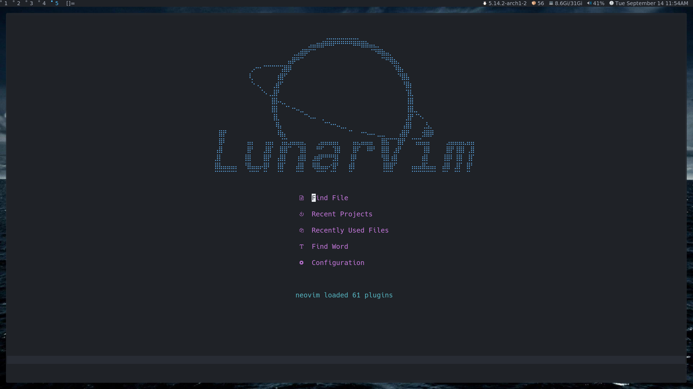
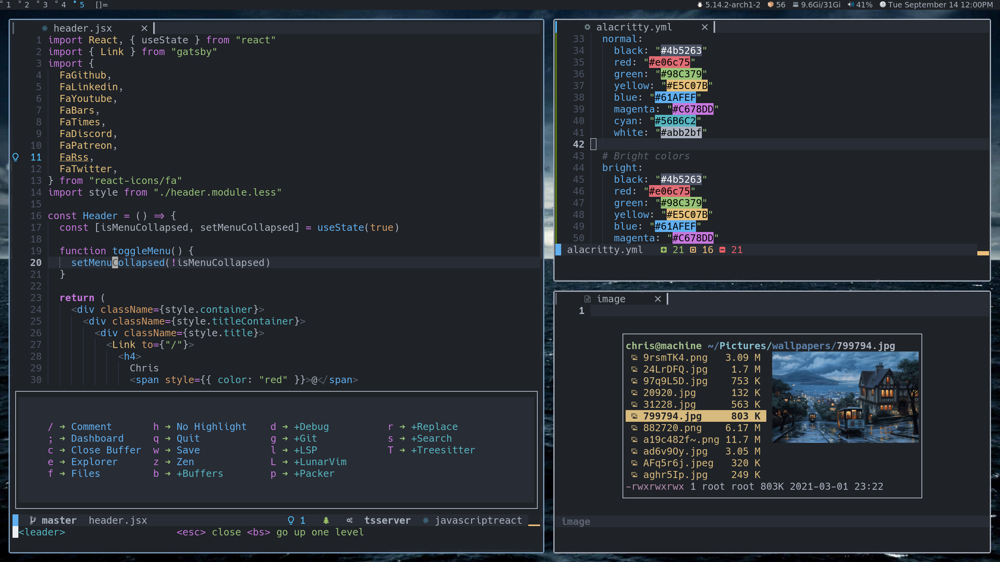
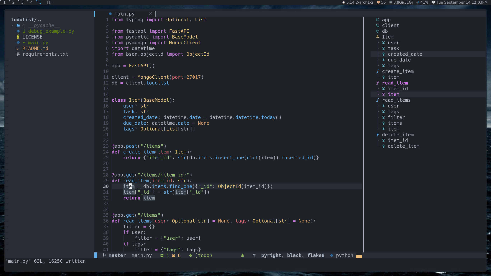

<div align="center"><p>
    <a href="https://github.com/ufovim/ufovim/releases/latest">
      
    </a>
    <a href="https://github.com/ufovim/ufovim/pulse">
      
    </a>
    <a href="https://github.com/ufovim/ufovim/blob/main/LICENSE">
      
    <a href="https://patreon.com/chrisatmachine" title="Donate to this project using Patreon">
      
    </a>
    <a href="https://twitter.com/intent/follow?screen_name=chrisatmachine">
      
    </a>
</p>

</div>

## Documentation

You can find all the documentation for ufovim at [ufovim.org](https://www.ufovim.org)

## Install In One Command!

Make sure you have the release version of Neovim (0.5).

```bash
bash <(curl -s https://raw.githubusercontent.com/ufovim/ufovim/master/utils/installer/install.sh)
```

## Install Language support

- Enter `:LspInstall` followed by `<TAB>` to see your options for LSP

- Enter `:TSInstall` followed by `<TAB>` to see your options for syntax highlighting

**NOTE** I recommend installing `lua` for autocomplete in `config.lua`





## Configuration file

To install plugins configure ufovim use the `config.lua` located here: `~/.config/ufovim/config.lua`

Example:

```lua
-- general
ufovim.format_on_save = true
ufovim.colorscheme = "onedarker"

ufovim.leader = "space"
-- add your own keymapping
ufovim.keys.normal_mode["<C-s>"] = ":w<cr>"
-- unmap a default keymapping
-- ufovim.keys.normal_mode["<C-Up>"] = ""
-- edit a default keymapping
-- ufovim.keys.normal_mode["<C-q>"] = ":q<cr>"
-- set keymap with custom opts
-- ufovim.keys.insert_mode["po"] = {'<ESC>', { noremap = true }}

-- Use which-key to add extra bindings with the leader-key prefix
-- ufovim.builtin.which_key.mappings["P"] = { "<cmd>Telescope projects<CR>", "Projects" }

-- Configure builtin plugins
ufovim.builtin.dashboard.active = true
ufovim.builtin.terminal.active = true

-- Treesitter parsers change this to a table of the languages you want i.e. {"java", "python", javascript}
ufovim.builtin.treesitter.ensure_installed = "maintained"
ufovim.builtin.treesitter.ignore_install = { "haskell" }

-- Disable virtual text
ufovim.lsp.diagnostics.virtual_text = false

-- set a formatter if you want to override the default lsp one (if it exists)
ufovim.lang.python.formatters = {
  {
    exe = "black",
    args = {}
  }
}
-- set an additional linter
ufovim.lang.python.linters = {
  {
    exe = "flake8",
    args = {}
  }
}


-- Additional Plugins
ufovim.plugins = {
    {"ufovim/colorschemes"},
    {"folke/tokyonight.nvim"}, {
        "ray-x/lsp_signature.nvim",
        config = function() require"lsp_signature".on_attach() end,
        event = "BufRead"
    }
}
```

## Updating ufovim

- inside ufovim `:ufovimUpdate`
- from the command-line `ufovim +ufovimUpdate +q`

### Update the plugins

- inside ufovim `:PackerUpdate`

## Breaking changes

- `ufovim.lang.FOO.lsp` is no longer supported after #1584.
  You can either use `:NlspConfig` for most of the settings you might need, or override the setup by adding an entry to `ufovim.lsp.override = { "FOO" }`.

## Resources

- [Documentation](https://www.ufovim.org)

- [YouTube](https://www.youtube.com/channel/UCS97tchJDq17Qms3cux8wcA)

- [Discord](https://discord.gg/Xb9B4Ny)

- [Twitter](https://twitter.com/chrisatmachine)

## Testimonials

> "I have the processing power of a potato with 4 gb of ram and ufovim runs perfectly."
>
> - @juanCortelezzi, ufovim user.

> "My minimal config with a good amount less code than ufovim loads 40ms slower. Time to switch."
>
> - @mvllow, Potential ufovim user.

<div align="center" id="madewithlua">
	
[](#madewithlua)
	
</div>
